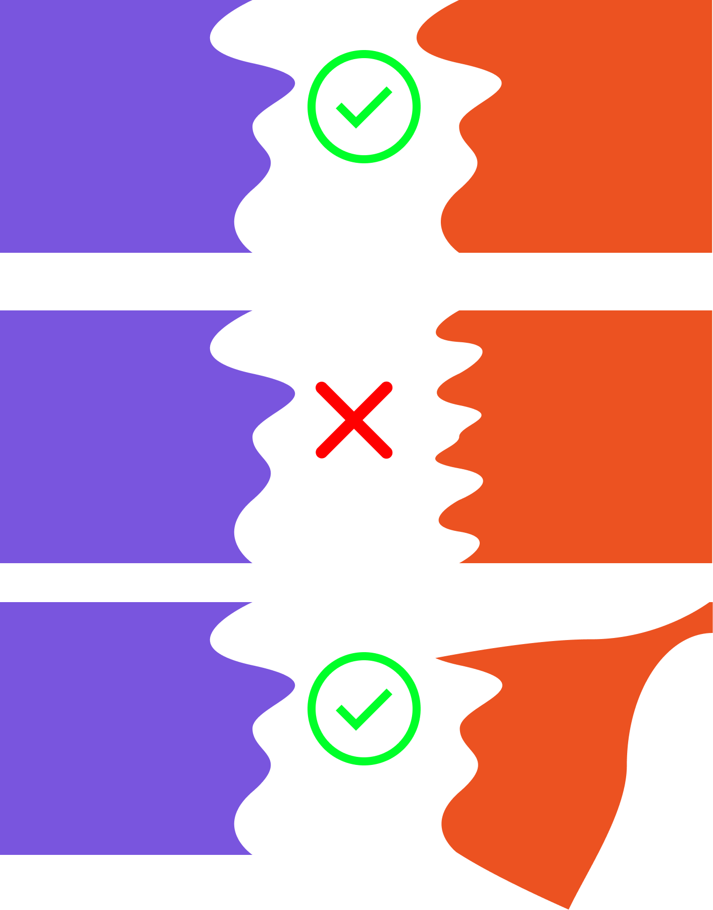

# 2D Shape Side Matching (Max 3700 Points)

> Task created by Ciko (Raden Francisco)

version **23 Juli 2025**

**IMPORTANT** SPEK YANG JADI PATOKAN ADALAH SPEK PADA GOOGLE DOCS!!!   
Untuk isi Readme ini, bisa dibilang summary sangat singkat ;)  
Tautan: [Spesifikasi Task 2D Shape Side Matching](https://docs.google.com/document/d/1UPctVxxkW7ja9wHAhP--Q0Ap2XpT4ESxrg8td5NTxFs/edit?tab=t.0)

## 💡 Latar Belakang

Shape Side Matching itu intinya apakah dua buah benda memiliki suatu sisi yang cocok untuk disambungkan. Contoh bentuk-bentuk puzzle jigsaw kan ada yang cocok ada yang tidak cocok nah gimana cara kita bisa tau? Tentunya banyak.

Nah pada tugas ini Anda diminta untuk membuat web sebagai solusinya. Anda akan memakai metode Computer Vision, string similarity, DP untuk akhirnya dapat menemukan suatu shape Y yang paling cocok sisinya dengan shape X. Tidak hanya itu, kita akan menggunakan DnC sebagai metode optimasi.

## 🧩 Spesifikasi Wajib (Max 2700 Poin)

### 🔧 Tech Stack

- **Frontend**: Web-based dengan _JS-based framework_ dan menggunakan **TypeScript**
- **Backend**: Bebas, harus bisa support pemrosesan gambar dan concurrency
- **Database**: SQL-based (PostgreSQL, MariaDB, SQLite, dsb). Disarankan ORM, boleh pake cloud (Firebase, AWS, etc)

### 🖼️ Computer Vision

- Cari pusat shape sebagai referensi
- Rotasi berdasarkan pusat
- **WAJIB**: Ekstrak _side profile_ (jarak pixel dari pusat ke tepi)
- _(Bonus)_ Tambahkan ekstraksi warna pada edge shape

### ✂️ Weighted Levenshtein

- Gunakan Weighted Levenshtein Distance untuk membandingkan _side profile_
- Formula insert/delete/substitution boleh disesuaikan dengan penyesuaian cost

### 🪓 Divide and Conquer

- Optimasi pencocokan shape menggunakan DnC

### 🚀 Concurrency

- Implementasikan concurrency saat ekstraksi gambar untuk mempercepat runtime

### 📦 Caching

- Cache hasil ekstraksi shape untuk efisiensi performa

## 🎁 Spesifikasi Bonus (Max 1000 Poin)

| Bonus Fitur                      | Poin    |
| -------------------------------- | ------- |
| Docker                           | 100     |
| Deploy full app (FE+BE+DB)       | 200     |
| Output gabungan gambar           | 200     |
| Color similarity on edges        | 500     |
| Speed challenge (top 3 tercepat) | 100–300 |

## 📂 Pengerjaan dan Pengumpulan

1. Buat repositori **private** di GitHub dan invite `nohaitch`
2. Kumpulkan **link tag release** dengan format `vN` (misal `v1`, `v2`, dst)
3. **Dilarang** menggunakan URL shortener
4. Submit melalui [seleksi IRK website](https://seleksi-irk-2025.vercel.app/) menggunakan akun `std.stei.itb.ac.id`, lalu:
   - Konfirmasi ke LINE: `@francisco131003`
   - Jadwalkan demo via LINE juga
5. Pertanyaan bisa diajukan langsung ke LINE: `@francisco131003`

---

**Total Maksimum Nilai: 2700 (wajib) + 1000 (bonus) = 3700 Poin**

Good luck and have fun! 🚀
